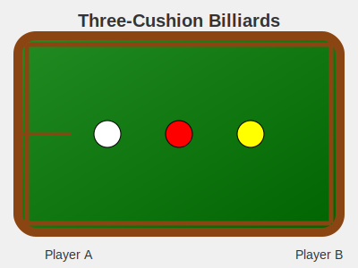

# Three-Cushion Billiards Simulator



## Description

Three-Cushion Billiards Simulator is a Java application that models the complex game of three-cushion billiards. This project demonstrates advanced object-oriented programming concepts, simulating the intricate rules and gameplay of this challenging billiards variant.

## Features

- Simulate a complete game of three-cushion billiards
- Track player scores, innings, and game state
- Implement complex shot validation rules
- Handle special cases like break shots and bank shots
- Manage fouls and their consequences
- Support for two players with different cue ball colors

## Key Concepts

- Game state management
- Turn-based gameplay simulation
- Complex rule implementation
- Shot validation and scoring
- Foul detection and handling

## Usage

To use the ThreeCushion class in your project:

1. Import the necessary classes:
   ```java
   import hw2.ThreeCushion;
   import api.PlayerPosition;
   import api.BallType;
   import static api.PlayerPosition.*;
   import static api.BallType.*;
   ```

2. Create a new ThreeCushion game:
   ```java
   ThreeCushion game = new ThreeCushion(PLAYER_A, 3);
   ```

3. Simulate gameplay:
   ```java
   game.lagWinnerChooses(true, WHITE);
   game.cueStickStrike(WHITE);
   game.cueBallStrike(RED);
   game.cueBallImpactCushion();
   game.cueBallImpactCushion();
   game.cueBallImpactCushion();
   game.cueBallStrike(YELLOW);
   game.endShot();
   ```

## Example

```java
ThreeCushion game = new ThreeCushion(PLAYER_A, 3);
game.lagWinnerChooses(true, WHITE);

System.out.println(game.toString());

game.cueStickStrike(WHITE);
game.cueBallStrike(RED);
game.cueBallImpactCushion();
game.cueBallImpactCushion();
game.cueBallImpactCushion();
game.cueBallStrike(YELLOW);
game.endShot();

System.out.println(game.toString());
System.out.println("Bank shot: " + game.isBankShot());
```

## API Highlights

- `ThreeCushion(PlayerPosition lagWinner, int pointToWin)`: Constructor
- `lagWinnerChooses(boolean selfBreak, BallType cueBall)`: Set up the game
- `cueStickStrike(BallType ball)`: Start a shot
- `cueBallStrike(BallType ball)`: Record cue ball hitting another ball
- `cueBallImpactCushion()`: Record cushion impact
- `endShot()`: End the current shot
- `foul()`: Record a foul
- `isBreakShot()`, `isBankShot()`, `isGameOver()`: Game state queries

## Future Improvements

- Graphical user interface for visual game representation
- AI opponent for single-player mode
- Network multiplayer support
- Shot suggestion system for learning players
- Replay system for analyzing completed games

## Author

Abhay Prasanna Rao

